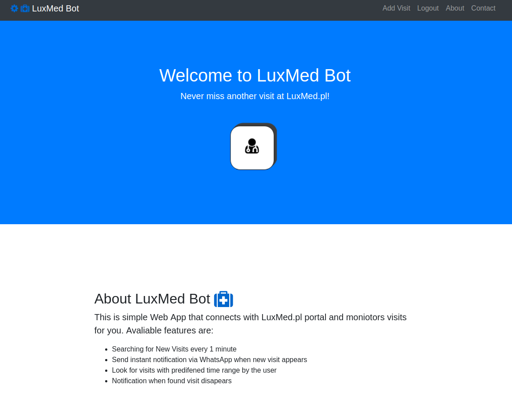

# LuxMed-Bot

A simple Python Django application to search for medical visits in LuxMed.pl portal.

## Getting Started

These instructions will get you a copy of the project up and running on your local machine for development and testing purposes. See deployment for notes on how to deploy the project on a live system.

### Prerequisites

- Docker installed on your machine
- Twilio.com account with Whatsapp SID and token
- Luxmed.pl account


### Installing

First of all we need to clone this project from the repository.


```bash
git clone https://github.com/MikePapinski/LuxMed-Bot.git
```

Next we need to update the Twilio SID and token in order to send Whatsapp notifications. If you do not want to send any notifications, just skip this step.

Open: /LuxMed-Bot/Project/luxmed/WhatsApp.py

Change from:
```python

    #Define the twilio SID and AUTH_TOKEN to process WhatsApp message:
    account_sid = ''
    auth_token = ''

```

To:

```python

    #Define the twilio SID and AUTH_TOKEN to process WhatsApp message:
    account_sid = '<YOUR_TWILIO_SID_NUMBER>'
    auth_token = '<YOUR_TWILIO_TOKEN_NUMBER>'

```
Of course replace <YOUR_TWILIO_SID_NUMBER> with your original SID from twilio portal and the same with <YOUR_TWILIO_TOKEN_NUMBER>.

Next we need to run our Docker containers. To do so we will use docker-compose. Open folder that container docker compose in your terminal.

#### For Linux users:    
Check if you can see docker-compose file.

Open the LuxMed-Bot folder in the terminal and type:
```bash
ls
```

You should see:
```bash
 docker-compose.yml   Dockerfile  'LuxMed-Bot presentation.pdf'   myvenv   Project   README.md   requirements.txt
```
Now lets run our dockerized images, Type in the terminal:

```docker
docker-compose up
```
Now the docker images will be build and after that will run on your host.

#### How to check if all the containers are running successfully?
Just type in the terminal:
```docker
docker container ls
```
You should see all the docker containers running on your host:

```docker
CONTAINER ID        IMAGE                    COMMAND                  CREATED             STATUS              PORTS                    NAMES
a50df52413e2        luxmed-bot_web           "python /code/Project..."   5 days ago          Up 50 seconds       0.0.0.0:8000->8000/tcp   luxmed-bot_web_1_379f7ed70ee6
81296070bb0a        luxmed-bot_celery        "celery -A Project w..."   5 days ago          Up 51 seconds       8000/tcp                 luxmed-bot_celery_1_62b4641f22d3
d41c88b46f3b        luxmed-bot_celery-beat   "celery -A Project b..."   5 days ago          Up 49 seconds       8000/tcp                 luxmed-bot_celery-beat_1_7c738e132405
3ba0e2856465        postgres:10.1-alpine     "docker-entrypoint.s..."   5 days ago          Up 55 seconds       5432/tcp                 luxmed-bot_db_1_e490c5f9687d
dd685d1b321b        redis:alpine             "docker-entrypoint.s..."   5 days ago          Up 56 seconds       6379/tcp                 luxmed-bot_redis_1_f383eda3909f
```


#### Now if you got to your localhost, you should see the application running.
```docker
localhost:8000
```

## Running the tests

This app has some simple unit test written to check if all end points work correct. To run the tests you need to run all the containers first.
- Container with Postgres Database must be running, unless there will be no connection to database therefore the tests won't work.

Attach the shell to the luxmed-bot_web container (This container with Django application.)

Type to the shell:
```bash
python manage.py test luxmed
```
You should see:
```bash
Creating test database for alias 'default'...
System check identified no issues (0 silenced).
.............................
----------------------------------------------------------------------
Ran 29 tests in 0.455s

OK
Destroying test database for alias 'default'...
```


## Deployment

Feel free to deploy this application to any hosting service that provides hosting with docker containers.

## Built With

* [Django](https://www.djangoproject.com/) - The python web framework used
* [Celery](http://www.celeryproject.org/) - The asynchronous tasks management
* [Redis](https://redis.io/) - Celery message broker
* [Postgress](https://www.postgresql.org/) - The database used
* [Bootstrap](https://getbootstrap.com/) - The html front end
* [Docker](https://www.docker.com/) - The container technology used
* [Twilio API](https://www.twilio.com/) - The API used for whatsapp notifications

## Contributing

Feel free to contribute to this project. I will review all the push requests and submit the valuable ones.

## Versioning

Git system was used for versioning anf of course kept in Github repository.

## Authors

* **Mike Papinski** - *Full-Stack* - [Github Profile](https://github.com/MikePapinski) - [Portfolio](http://mikepapinski.gear.host/) - Contact: mp.papinski@gmail.com

## License

This project is opened source.

## Acknowledgments

* Dockerized all the future projects
* Django is cool for small size projects
* Use Celery for background tasks
* Pay attention to your code before submitting a commit
* Write and run unit tests to cover all your app functionality
